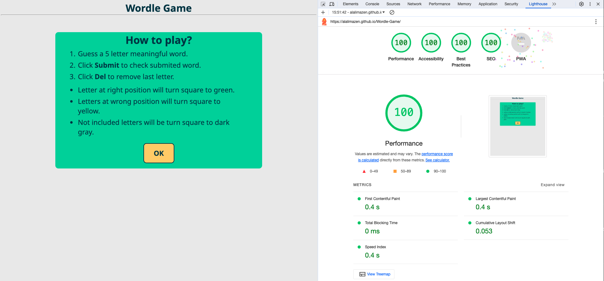
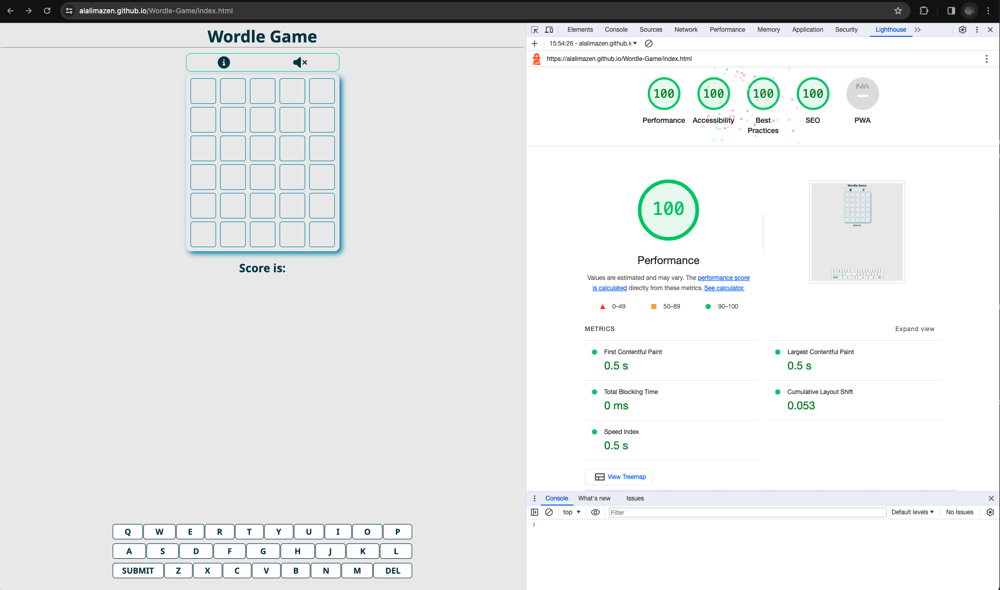
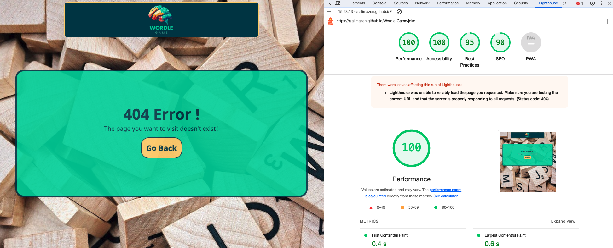
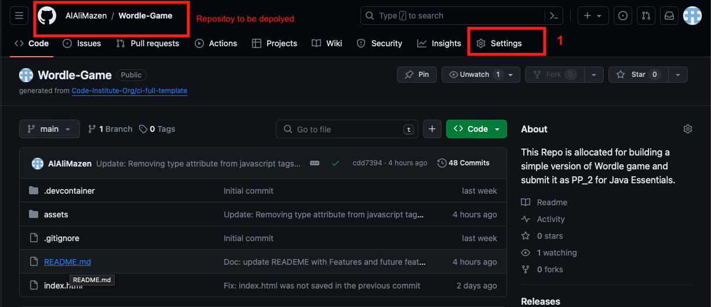
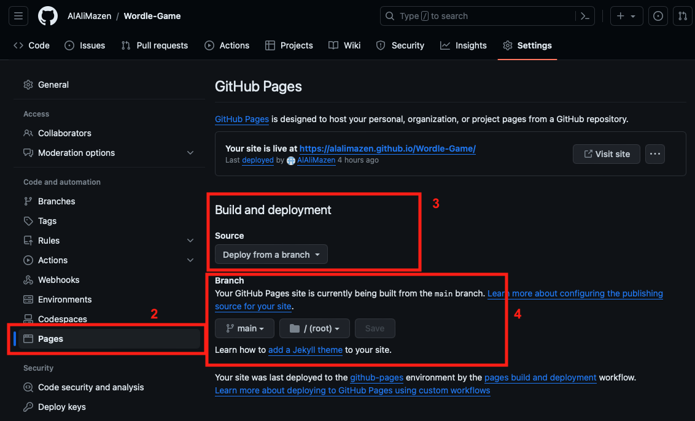
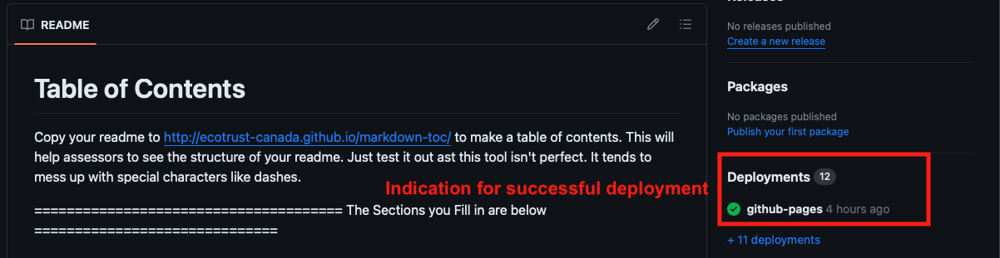

# Wordle Game
🚨**Required** 

In simple eords, **WordleGame** is an international game where player should guess the right word in six tries. In other words, there are 6 rows and each row has 5 square for a 5 letter meaningful word. The word itself should not be an acrynom or a person name. 

If player guessed a right letter at right positon, the game board square and the keyboard key will be turned to a green.

If player guessed a right letter at wrong position, the game board square as will as the keyboard key will be turned into yellow.

If player's guess is neither a right letter or at right position, then game board square and the keyboard key will be gray coloured.

Wordle Game is also responsive and load like in the following **am I responsive here** [wordle-Game](https://ui.dev/amiresponsive?url=https://alalimazen.github.io/Wordle-Game/)
and it looks like  with how to play-to-play instructions. 

When game starts it looks like following screenshot  .

## Live Site
🚨**Required** 

- A live Wordle Game based on the written and implemented code is deployed on GitHub Pages under [Wordle-Game](https://alalimazen.github.io/Wordle-Game/) .

## Repository
🚨**Required** 

-Game is hosted on GitHub and code can be checked up at the following repository [Word-Game](https://github.com/AlAliMazen/Wordle-Game) .

## Author
🚨**Required** 

Mazen Al Ali

- [Wordle Game](#wordle-game)
  * [Live Site](#live-site)
  * [Repository](#repository)
  * [Author](#author)
  * [Table of Contents](#table-of-contents)
- [UX](#ux)
  * [Target Audience](#target-audience)
  * [Project Goals](#project-goals)
  * [User Stories](#user-stories)
    + [Site User Stories](#site-user-stories)
    + [Developer Stories](#developer-stories)
  * [Design Choices](#design-choices)
    + [Typography](#typography)
    + [Imagery](#imagery)
    + [Animations and Transitions](#animations-and-transitions)
  * [Design Elements](#design-elements)
  * [Wireframes](#wireframes)
    + [Features](#features)
    + [Implemented Features](#implemented-features)
  * [Future Features](#future-features)
  * [Testing and Validation](#testing-and-validation)
    + [CSS Validation](#css-validation)
    + [HTML Validation](#html-validation)
    + [Javascript Validation](#javascript-validation)
  * [Compatibility and Responsive Testing](#compatibility-and-responsive-testing)
  * [Accessibility Testing](#accessibility-testing)
- [Technologies Used](#technologies-used)
  * [Languages](#languages)
  * [Frameworks, Libraries & Programs Used](#frameworks--libraries---programs-used)
- [Deployment](#deployment)
  * [Deploy to GitHub Pages](#deploy-to-github-pages)
- [Credits](#credits)
  * [Content](#content)
  * [Media](#media)
  * [Code Refernces](#code-refernces)
  * [Acknowledgments](#acknowledgments)

<small><i><a href='http://ecotrust-canada.github.io/markdown-toc/'>Table of contents generated with markdown-toc</a></i></small>

# UX
🚀 **merit & beyond**

Wordle game has the theme which resembles the traffic lights. From the first glance I thought it like so, wheever the letter turns green, go with this letter at the same position. Whenever it is yellow, prepare yourself to use this letter but on a different position. Thought Red Light doesn't fit in, rather it is gray which is nto that intuitive for player indicating that this letter is not included in the word. 

I think in the future, I will repace the gray color with a soft red color for indicating a warning not to use this letter again. Red color has the characteristics that it refers to something either not good or even wrong. Discussing this topic with my friends, thy find the gray color not that suitable for this indication and that is why I will properly replace it with soft red color from the color platte I used in the whole game.

## Target Audience
🚀 **merit & beyond**

- On one side, this game targets English learners whi want to test their knowledge to guess 5 letter words based on the game board which is very helpful.

- On the other side, it targets the junior developers who want to test their understanding of JavaScript and the interactivity between UI (HTML and CSS) amd backend with (JS).

## Project Goals
🚀 **merit & beyond**

- Mainyl is the ability to have interaction between end user and the website. Project Goal for Wordle Game is to take user choice, process it and get the consequence of that choice. 

- Another goald is to build a game which is internationally known but with a differnt code base. The idea is not to repeat the same code and have a code clone, but rather to build this game with a different code base and as simple as possible make it possible for future learner to know that it is still possible and can even be improved.

## User Stories
🚀 **merit & beyond**

### Site User Stories
🚀 **merit & beyond**

Many of my friends reposrted that the game is very interestting but it should have some features like giving hints about the random word which can make is easier to anticpate the game. This feature is a good feature to have in the future as I am also conveniced about it.

### Developer Stories
🚀 **merit & beyond**

- As a developer I have though, it is going to be difficult to implement the logic of the wordle game, but it turns to be not that hard after making use of the functinos and instrcution shown by the JS Essentials by Code Institue. I could understand the Game logic and I started implementing the fuctions on after another as the module goes on. It is worth mentioning that searching the web for JS is very helpful and overwohlming at the same time. 

## Design Choices
🚀 **merit & beyond**

Your site is most likely geared to a certain audience, and your design choices should tie into them. Let the assessors know your thought process.

You may want to re-watch the videos about the [5 planes of UX development ](https://learn.codeinstitute.net/courses/course-v1:codeinstitute+FE+2017_T3/courseware/22905698f3be425d918ebc64c87801b7/9c295bdc5a4048308460e262b14ab7df/) when writing up this section

### Typography
🚀 **merit & beyond**

- Because each user key stroke is going to be a single letter, I paid special attention for a font which is soft and clear even when small letter is used. 

- Font family is 'Nato Sans', which belongs to sans-serif and taken from Google font under [Noto Sans](https://fonts.google.com/noto/specimen/Noto+Sans) with following weights:

    - 100
    - 200
    - 300
    - 400
    - 500
    - 600
    - 700
    - 800
    - 900

    with bold style.
- Tests on the font includes using small capital i and small l like in Illuminate, for example. 

### Imagery
🚀 **merit & beyond**
Two main images I have brough from Pexels for using as Background for the 404 page. These images are also hat the topic which is related in a way or another on brainstorming for guessing words.

### Animations and Transitions
🚀 **merit & beyond**

- I have implemented the transform attribute from JavaScript to give the game board special effect after a word is submitted. The row gets colored and then it rotates from 0 to 90 to 180 to 360 

- After the game ends regardless if player has won the game or lost, the on-screen keyboard key gets the same totating effect from the game board to be restted. 

## Design Elements
🚀 **merit & beyond**

While player playes the game, it is possible to switch the backgrund music on or off. The icon of volumn in at the top game screen is connected to a JS function that turns backgriund music on and off. The Icon itself will also be changed reflecting the status of the music. Based on the status of music, the corresponding icon will be shown.

## Wireframes
🚀 **merit & beyond**

Wireframes are done using the Balsamiq software licesned by Code Institute and I have made a wireframe for **desktop** and **mobile devices** and both can be found under the assets/wireframes .

### Features
🚨**Required** 

Right from the beginning when the game loads, it starts by showing user a set of instructions on how ot play and what color has which meaning. After touching or clicking on **OK** button, the game board and the on-screen keyboard  and in the middle there is a scoring calculation tracker. 

### Implemented Features
🚨**Required** 

- Instruction window: When game load at the first stage, it opens up with a how-to-play instructions. This window is connected to Javascript file through a ducntion responsible to hide this window and show the game UI.

- On the top of the gameboard there are two incons on is lillte i circle used to show the instructions and hide the whole game UI elements and hid it again to show the game UI. 

- Next to the instructions icon there is a volum icon. When clicked a background music will start playing help player to listen to music while playing. The same icon is also used to pause the backgriund music.

- Gamebaord: a grid UI of 5 squares and 6 rows. Whenever player is ready with aguess of a word, player can click on **Submit** key to check the typed word against the random selected word.

- Coloring Gameboard: when letter is at right position, square will be turned into green. When letter is at wrong position but still included in the random word, square will be turned into yellow. When letter is not included in the random word, square will be turned into gray. 

- Play again button: This button is going to be shown only when either play wins the game at what ever row, or when player loses without guessing the right word. **Play again** button is used to reset both game board and the on-screen keyboard. 

- Notifications: There are 3 notification while game is running. First one is when user has guesed the random word using 'window.aler()' built in function. The second notification is when player loses the game, a notification will be shown telling user that game is over and what the random word is. The last notification is shown when the size of the browser or device dimension. 

- On-screen keyboard: The keyboard is used to get the letter into the gameboard squares. The Keyboard get also colored when player has guessed right letter at right position, right letter at wrong position or not included letter to avoid these letter on the next try. 

- Animation of both game board and keyboard: When a word is submitted the row on the gameboard is rotated and gets colored from side of Javascript implemention CSS code. The same animation is applied to the keyboard keys after **play again** button. 

- Scoring: since we have a word of 5 letters, player will get 20 points for each right letter at the right position. Only 10 points for a right letter at the right position. If player gets the right word from the first try, s/he will get 100 point + 105. The 105 is so aggregated the player will lose 5 points for each row (which is considered a try) (5+10+15+20+25+2+30 =105).

## Future Features
🚀 **merit & beyond**

- One of the future feature which I would like to implement when completing the database module it to link this game to a central database and add statistics to the game to show results between different player from all over the globe.

- Gives hints after the third and fourth row about the random word. This requires to turn the words list to an object where each word can have more than one hint and its meaning when player either guessed the word games finishes up.

## Testing and Validation
🚨**Required** 

### CSS Validation
🚨**Required** 

Following screenshot has been don on the following website and it shows no errors in the whole page.
[CSS validator](https://jigsaw.w3.org/css-validator/)

 .

### HTML Validation
🚨**Required** 

All html pages included in this game are validated on the following website.
[HTML Validator](https://validator.w3.org/)

**index.html**

 .

**404.html**

### Javascript Validation
🚨**Required** 
There are two JS files used in this game. Both of them are validated on the following website and showing no errors
[JSON validation](https://jsonlint.com/) 

**main.js**

**words** 

## Compatibility and Responsive Testing
🚨**Required** 

1. Checking the [statecounter](https://gs.statcounter.com/browser-market-share) for most common and widely used browsers I decided to have a website that is responsive on these browsers including 

|   Web browsers                    | Version
|-----------------------------------|------------------------|
| Google Chrome                     |Version 121.0.6167.160  |
| Safari                            |Version 17.3.1          |
| Microsoft Edge                    |Version 121.0.2277.112  |
| Firefox Browser Developer         |Version 123.0b9 (64-bit)|
| Opera One                         |version: 107.0.5045.15  |

**Device**

|   Device                    | Version           |        Dimesnion    |
|-----------------------------|-------------------|---------------------|
| iPhone 14 Pro Max (real)    | iOS v. 17.2.1     |
| iPad 4   (real)             | iOS v. 17.2       |
| iPhone SE                   |                   | 375 x 667
| iPhone XR                   |                   | 414 x 896
| iPhone 12 Pro               |                   | 390 x 844
| Pixel 7                     |                   | 412 x 915
| Samsung Galaxy              |                   | 360 x 740
| Samsung Galaxy S20 Ultra    |                   | 412 x 915
| iPad Mini                   |                   | 768 x 1024
| iPad Air                    |                   | 820 x 1180
| ipad Pro                    |                   | 1024 x 1366
| Surface Pro 7               |                   | 912 x 1368
| Surface Duo                 |                   | 540 x 920
| Galaxy Fold                 |                   | 280 x 653
| Samsung Galaxy A51/71       |                   | 412 x 914
| Nest Hub Max                |                   | 1280 x 800

**Important to Note** 

Currently I have tried my best to get the UI as responsive as possible but I figured an issue related to a device called (Nest Hub) which turns to be a device from google used to manage other devices inside smart houses. The referenced device is not supposed to be used as a game device since it is fixed in a wall or welcome device at an entrance.

## Accessibility Testing
🚨**Required** 

Testing the accessibility of the wordle game is done used the following tool provided by Google Chrome and demonstrated by Code Institute. Screenshots are taken after the test
**Lighthouse**
All tests using Lighthouse is done on the deployed version on the GitHub Pages

**Index.html** shows 100% accessibility shown in the following screenshot 

after loading the game baord I have run the lighthouse again to see any changes, but it shows perfect results

the **404.html** page shows merely same result 

# Technologies Used
🚀 **merit & beyond**

## Languages
🚀 **merit & beyond**

Programming languages used to develope the Wordle Game on this website is the main **HTML** **CSS** and **JavaScript**

## Frameworks, Libraries & Programs Used
🚀 **merit & beyond**

Along with using programming decalrative (HTML & CSS) and imperative (JS) languages I have used following technologies and websites to get my project done 

- Balsamiq
- Coolors.co
- fontawesome
- github
- google fonts
- font awesome
- amiresponsive
- table of contents creator
- VS Code IDE

# Deployment
🚨**Required** 

## Deploy to GitHub Pages
I have made it sure to deploy me project as early as possible using the GitHub new service; that is, the GitHub Pages and I followed the following steps to do so: 

    1- Open the Repository which I want to deploy.
    2- Click on the Settings in the menubar as shown in the following screen shot

    3- Click on **Pages** on the left hand side.
    4- Right from the shown screen, choose the branch to deply. 
    5- Set the branch to be the **main** branch and click on save.

    6- Deploying on GitHub pages takes sometime and you can see it when it is done on the main Repository page.

# Credits
🚨**Required** 

Wordly Game is very know espacially in the English speaking countries where it is originally created and coded. I have used the following media and snippet to get an idea about what it is and how it works. However, I want to assure that the code written here is not in any way copied or similar to any of the available online sites except for the word list which is made public on GitHub under free license to use.

## Content
🚨**Required** 

 - Information about what Wordly game is and how to play it is found under [How to paly wordly game board](https://youtu.be/EQpQjLusKZw?si=H0CK00sqdU9mFvNS)

 - Word list were brough from free CodeCamp found under [How to build wordle Game in JavaScript](https://www.freecodecamp.org/news/build-a-wordle-clone-in-javascript/)

 - Live runnable example is shown in this youtube video [Build wordle game](https://www.youtube.com/watch?v=j7OhcuZQ-q8)

 - Playing wordle on the website to get a sense of how logic work behind the sense made clearly under [wordle game](https://wordlegame.org) wher e more languages is also possible to play around with.

## Media
🚨**Required** 

As for the Media content I have used Canva as main destination for creating the Logo and free Sound Library to get the background musis. 
 -  Logo is create using Canva [Logo Design](https://www.canva.com/design/DAF8EBhyiTc/iZ9f48KS0KtgqPmznVzW8g/edit) .

- Sound Track is brought from playonloop website called [sunset-break](https://www.playonloop.com/2012-music-loops/sunset-break/) .

- Font is done using Google font found on the great Google library called [Nato-sans](https://fonts.google.com/noto/specimen/Noto+Sans)

- Color Plate is a mixture brought from coolors website found under this Link [color Platte](https://coolors.co/palette/ef476f-ffd166-06d6a0-118ab2-073b4c) 

- Gray Color is also brought from coolors found under this link [gray color plate](https://coolors.co/palette/23233b-2c4268-007bba-00a9e2-7ccdf4-bce3fa-9b9c9b-b2b0b0-c5c6c6-ebebeb)

- Icons for both instructions and sound effects is brought from fontawoesome website [information icon](https://fontawesome.com/icons/circle-info?f=classic&s=solid) |
[music on Icon](https://fontawesome.com/icons/volume-high?f=classic&s=solid) |
[muted music Icon](https://fontawesome.com/icons/volume-xmark?f=classic&s=solid) .

- Background image used in the 404 Page is brought from Pexels [ADHD Super Powers Written on Chalkboard
](https://www.pexels.com/photo/adhd-super-powers-written-on-chalkboard-8378741/) .

- Background image used as background also for 404 page is brough from Pexels [Brown Scrabble Boards With Letters](https://www.pexels.com/photo/brown-scrabble-boards-with-letters-278887/) .

- For favicon I have used the [Favicon generator](https://favicon.io/) 

## Code Refernces
- List or words is brought from [Word List JS File](https://github.com/Morgenstern2573/wordle_clone/blob/master/build/words.js)

- Grid CSS Reference is implemented using [CSS-Trick on Grid](https://css-tricks.com/snippets/css/complete-guide-grid/)

- Interactive Grid in CSS is imeplemented  usingg [interactive Guide to CSS Grid](https://www.joshwcomeau.com/css/interactive-guide-to-grid/)

- A Complete Guide to Flex in CSS is implemented using [CSS Trick Flex in CSS](https://css-tricks.com/snippets/css/a-guide-to-flexbox/)

- Guide on Animation and transform as well as transition is brought from MDN Web Docs 
[transfomr Docs](https://developer.mozilla.org/en-US/docs/Web/CSS/transform) |
[transiton Docs](https://developer.mozilla.org/en-US/docs/Web/CSS/transition) |
[Animation Docs](https://developer.mozilla.org/en-US/docs/Web/CSS/animation)

## Acknowledgments
🚀 **merit & beyond**

Guidelines on how JS function are best used and implemented is made clesr based on the lessons provided by:

- [Code Institute Full-Stack-Developer Cours](https://codeinstitute.net/de/full-stack-software-development-diploma/)

- My Mentor Mrs. Malia on Slack who always enrich my knowledge about new features and guidelines and suggestions. No need to say that she took my step under the loop and always being very precise about how and what to do. 

